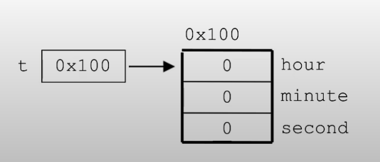

### 클래스와 객체
+ 클래스
    + 클래스의 정의: 객체를 정의해 놓은것
    + 클래스의 용도: 객체를 생성하는데 사용
+ 객체
    + 객체의 정의: 실제로 존재하는 것, 사물 or 개념
    + 객체의 용도: 객체가 가지고 있는 기능과 속성에 따라 다름
> Ex) 제품설계도 & 제품, TV설계도 & TV
+ 객체 = 속성(변수) + 기능(메서드)
> Ex) TV - 속성: 크기, 길ㄹ이 높이, 볼륨 ... - 기능: 켜기, 끄기, 볼륨 높이기
+ 인스턴스: 특정 클래스로부터 생성된 객체
> Ex) TV의 설계도 ->  제품생성 -> TV　|　클래스 -> 인스턴스화 -> 인스턴스　|　클래스작성- > 객체 생성- > 객체 사용
+ 객체의 생성
    + 클래스명 변수명;　　　　　　　　　　클래스의 객체를 참조하기 위해 참조 변수 선언
    + 변수명 = new 클래스명();　　　　　 　클래스의 객체 생성후, 객체의 주소를  참조변수에 저장
    + Tv t;　　　　　　　　　　　　　 　　　Tv클래스 타입의 참조변수 t를 선언
    + t = new Tv();　　　　　　　　　 　　　Tv인스턴스 생성 후, 생성된 Tv인스턴스의 주소를 t에 저장
+ 객체의 사용
    + t.channel = 7;　　　　　　　　 　  Tv인스턴스의 멤버 변수 channel의 값을 7
    + t.channelDown();　　　　　　　　 Tv인스턴스 의 메서드 channelDown() 호출
+ 객체 배열 === 참조 변수 배열
    + Tv tv1, tv2, tv3 === Tv[] tvArr = new Tv[3];   // 길이가 3인 Tv타입 참조변수
  ```
  Tv[] tvArr = new Tv[3];
  tvArr[0] = new Tv();
  tvArr[1] = new Tv();
  tvArr[2] = new Tv();
  ```
    + 객체 배열을 생성한 후 각각의 값을 넣어줘야한다.<br/><br/>

+ 클래스
    + 설계도
    + 데이터 + 함수의 결합
    + 사용자 정의 타입<br/><br/>
1. 변수: 하나의 데이터를 저장할 수 있는 공간
2. 배열: 같은 종류의 여러 데이터를 하나로 저장할 수 있는 공간
3. 구조체: 서로 관련된 여러 데이터 (종류 상관무) 를 하나로 저장할 수 있는 공간
4. 클래스: 데이터와 함수의 결합 (구조체 + 함수) - > 서로 관련있으니까 묶어서 사용
```
class Time{
  int hour;
  int min;
  int sec;
}
Time t = new Time();
```


[비객체지향적]

<br/><br/>
[객체지향적]



```
class Variables{

    int iv;             // 인스턴스 변수
    static int cv;      // 클래스 변수 (static변수, 공유변수) 
    
    void method(){
        int lv = 0;     // 지역변수 
    }
}
```
+ 선언위치에 따른 변수의 종류
    + 클래스 변수
        + 클래스 영역 -> 클래스가 메모리에 올라갈때 생성됨 ( 객체 생성안해도 자동으로 올라감 )
    + 인스턴스 변수
        + 클래스 영역 -> 인스턴스가 생성되었을때 만들어짐 ( 객체 생성을 해야 쓸 수 있음 )
    + 지역 변수
        + 클래스 영역 이외의 영역 -> 변수 선언문이 수행 되었을때 생성, 메서드 종료시 자동 제거
  > 객체 = 인스턴스 변수의 묶음
>
+ 클래스 변수와 인스턴스 변수
    + 공통적인 속성은  - > 클래스 변수로 만들어줌 (static)
    + 개별 속성은 인스턴스 변수 사용
```
  class Card{
    String kind;      카드 무늬
    int num;          카드 숫자
    
    static int width;  폭
    static int height; 길이
  }