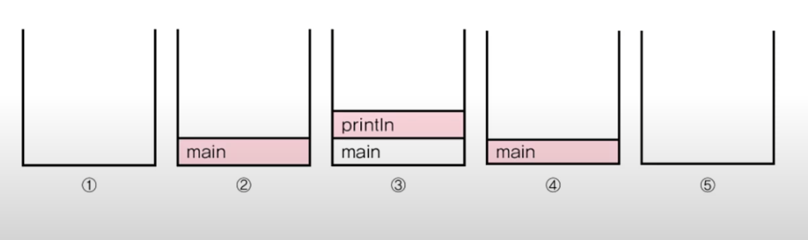

### 메서드
+ Method
    + 작업 단위로 문장들을 묶어서 이름을 붙인 것
    + 값(입력) 을 받아서 처리하고 , 결과를 반환 (출력)
    + 클래스 영역에서만 정의 가능<br/><br/>

+ 메서드의 실행 흐름
```
   Mymath mm = new MyMath();     // 먼저 인스턴스를 생성
   
   long value = mm.add(1L,2L);    // 메서드를 호출
   
   log add(long a, long b) {
   
      return a + b;
   }
   ```
1. main 메서드에서 메서드 add를 호출한다. 인수 1L, 2L 이 메서드 add의 매개변수 a,b에  각각 대입 된다.
2. 메서드 add의 괄호 {} 안에 있는 문장들이 순서대로 수행된다.
3. 메서드 add의 모든 문장이 실행되거나  return문을 만나면, 호출한 메서드(main 메서드)로 되돌아와서 이후의 문장들을 실행한다.

  + 반환값<br>-반환타입이 void가 아닐때 return값의 타입이 일치해야 댐<br></br>
    + 호출 스택 (call stack)
      + 메서드 수행에 필요한 메모리가 제공되는 공간
      + 메서드가 호출되면 호출스택에 메모리 할당, 종료되면 해제
      ```
      class Ex04_2 {
        public static void main(String[] args) {
            System.out.println("Hello");
        }
      }
      ```
      
    
      1. main 메서드가 호출되면서 메모리가 올라간다.
      2. main 메서드가 println() 메소드를 호출하면서 메인메서드는 대기 상태가 된다.
      3. println() 메서드가 실행 된 후 화면에 결과값을 보여주고 스택에서 사라지면서<br> 자신이 사용했던 메모리를 반환해준다.
      4. 그 후 대기 상태에 있던 main 메서드가 실행 상태로 돌아가며, 더 이상 main에서 호출할 메서드가 없기 때문에 main 도 종료가 되어 스택 또한 비워지게 되며,<br> 프로그램이 종료된다. 